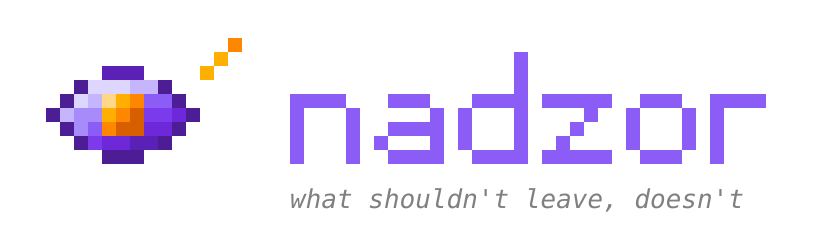

<div align="center">



**Encontra e valida dados sensíveis brasileiros e segredos vazados — offline, por dígito verificador, antes de chegarem ao seu log, ao seu CI ou ao contexto do seu agente de IA.**

[](LICENSE)
[](go.mod)
[](https://github.com/mkmuniz/nadzor/actions/workflows/ci.yml)

[English](README.md)

</div>

---

## Estado

**M0 concluído — só o alicerce. Nenhuma detecção funciona ainda.** Precisa de ferramenta hoje? Use [betterleaks](https://github.com/betterleaks/betterleaks) ou [kingfisher](https://github.com/mongodb/kingfisher). O nadzor é construído sobre o primeiro.

## O que detecta

| Dado | Validação offline | Algoritmo |
|---|:---:|---|
| **CPF** | ✅ | Módulo 11, dois DVs; rejeita sequências repetidas |
| **CIN** | ✅ | Usa o CPF como número nacional — mesma validação |
| **CNPJ** numérico | ✅ | Módulo 11, pesos `5,4,3,2,9,8,7,6,5,4,3,2` |
| **CNPJ** alfanumérico | ✅ | Módulo 11 com `ASCII − 48` nas letras — **vigente desde 06/07/2026** |
| **CNH** | ✅ | Módulo 11, variante de 11 dígitos |
| **PIS / NIS / NIT** | ✅ | Módulo 11, pesos `3,2,9,8,7,6,5,4,3,2` |
| **Título de eleitor** | ✅ | Dois DVs, módulo 11, com código de UF |
| **CNS** (cartão SUS) | ✅ | Soma ponderada ≡ 0 (mod 11) |
| **PAN de cartão** | ✅ | Luhn + faixa de BIN |
| **Chave Pix** | ✅ | Por tipo: CPF/CNPJ, e-mail, telefone, EVP (UUID v4) |
| **E2EID de Pix** | ✅ | `E` + ISPB(8) + `AAAAMMDDHHMM` + 11 alfanuméricos |
| **Agência / conta** | ⚠️ | DV varia por instituição |
| **RG** | ❌ | **Sem padrão nacional.** Só heurística contextual, confiança baixa |
| **Segredos** (463 regras) | via provedor | Delegado ao [betterleaks](https://github.com/betterleaks/betterleaks) |

A maioria dos detectores casa CNPJ com `\d{14}`. Isso está errado desde julho de 2026.

Base de ISPB do [`guibranco/BancosBrasileiros`](https://github.com/guibranco/BancosBrasileiros) — mais de 400 instituições, atualizada diariamente.

## Onde roda

| Superfície | O que faz | Estado |
|---|---|---|
| **Contexto de agente de IA** | Hook `PostToolUse` para Claude Code e Codex. O `cat .env` chega tarjado ao modelo | 🎯 MVP |
| **Transcripts de agente** | Audita o que já vazou para `~/.claude/projects/*.jsonl` | 🎯 MVP |
| **CI/CD** | CLI, GitHub Action, SARIF, pre-commit, pre-receive | planejado |
| **Runtime da aplicação** | `slog.Handler` e middleware HTTP que tarjam antes de escrever | planejado |
| **Observabilidade** | Processador de OpenTelemetry Collector para log e trace | planejado |

## Por que existe

Detecção de segredo é problema resolvido e concorrido — betterleaks tem 463 regras, kingfisher 1.051. Reconstruir esse corpus é perder. Então o nadzor **importa o betterleaks** (MIT) e gasta tudo no que ninguém construiu: **dado sensível brasileiro**. Nenhuma ferramenta open source mantida detecta CPF, CNPJ, CNH, chave Pix, PAN e E2EID. Não é mal servido — é vazio.

A segunda razão é arquitetural. O betterleaks valida segredo perguntando ao provedor por HTTP, o que exige rate limiter, orçamento de timeout e cuidado com o destino das requisições. Dado pessoal brasileiro não funciona assim: CPF é módulo 11, cartão é Luhn, chave Pix é o tipo dela. **Tudo offline.** Sem rede, sem limite de vazão, sem superfície de SSRF. Mais simples e mais seguro, não só diferente.

### Por que o transcript importa

Um `.env` tem proteções — gitignore, permissão de arquivo, cofre. O `~/.claude/projects/*.jsonl` não tem nenhuma: texto puro, sem criptografia, sem rotação, sem expiração, sem ferramenta de segurança vigiando. Quem lê o disco — malware, notebook roubado, backup exfiltrado — lê todo segredo que o agente já tocou.

O nadzor reduz o que entra ali e mostra o que já entrou. Não substitui criptografia de disco.

Documentado no próprio repositório do Claude Code: [#44868](https://github.com/anthropics/claude-code/issues/44868), [#50014](https://github.com/anthropics/claude-code/issues/50014), [#95680](https://github.com/anthropics/claude-code/issues/95680).

## O que "validar" significa aqui

| | Segredo | Dado pessoal |
|---|---|---|
| Responde | **Está vivo?** | **É estruturalmente real?** |
| Mecanismo | HTTP ao provedor | Aritmética local |
| Rede | obrigatória | **nenhuma** |
| Latência | 50–500 ms | microssegundos |
| Próximo passo | revogar / rotacionar | tarjar / remover |

**A linha que o nadzor não atravessa:** dado pessoal é validado pela *estrutura*, nunca consultando base oficial. O nadzor diz que `123.456.789-09` é um CPF estruturalmente válido. Nunca de quem.

## Princípios de projeto (inegociáveis)

1. **Um valor detectado nunca chega a um modelo de linguagem.** Garantido por teste de CI bloqueante.
2. **Dado pessoal é validado estruturalmente, nunca contra base oficial.**
3. **Saída de modelo é sinal, nunca filtro.** Pode reordenar fila; não pode descartar achado.
4. **Fail-open na tarja, fail-closed no relatório.** Quebrar a sessão é pior que deixar de tarjar; reportar "limpo" com scan quebrado é pior que build vermelho.
5. **Códigos de saída distintos:** `0` limpo, `3` achou, `1` erro.
6. **Zero falso positivo em valor estruturalmente inválido.** Se o DV não fecha, não é CPF.
7. **Limiares calibrados por idioma.** Heurística afinada para inglês erra em código em português.

Registros completos em [`docs/adr/`](docs/adr/).

## Roadmap

| | Milestone | Estado |
|---|---|---|
| M0 | Fundação | ✅ |
| M1 | Detectores BR + validação offline | ⬜ |
| M2 | Motor de segredos via betterleaks | ⬜ |
| M3 | **MVP — superfície de IA** | ⬜ |
| M4 | CLI, CI/CD, SARIF, scrub de transcript | ⬜ |
| M5 | Corpus multilíngue + calibração pt-BR | ⬜ |
| M6 | SDK de runtime | ⬜ |
| M7 | Camada de IA | ⬜ |
| M8 | Coletor de observabilidade | ⬜ |
| M9 | Validação de segredo + allowlist de destino | ⬜ |
| M10 | v1.0 | ⬜ |

Features, passo a passo, estratégia de teste e critério de saída por etapa: [`MILESTONES.md`](MILESTONES.md). Desenho de componentes e orçamentos: [`ARCHITECTURE.md`](ARCHITECTURE.md).

**Sobre o M5.** O betterleaks filtra candidatos por razão de token BPE contra um dicionário de 33.775 palavras **em inglês** e limiar fixo de 2,5. Medido com o tokenizador que ele mesmo embute: `defaultpassword` dá 7,50 e é corretamente descartado; `senhapadrao` dá 2,20 e é reportado como segredo. Segredos reais ficam em 1,0–1,6. Em inglês a separação é confortável; em português quase some. O M5 transforma isso em corpus versionado e métrica cobrada no CI.

## Estrutura do projeto

```
detect/br/        # o nucleo: validadores puros, zero dependencia
detect/engine.go  # a interface Engine — isola a API v2 do betterleaks
engine/secrets/   # betterleaks embrulhado atras dessa interface
redact/           # tarja preservando formato
report/           # JSON, JSONL, SARIF
stream/           # stdin -> stdout, o caminho do MVP
transcript/       # leitor de log de sessao de agente
hooks/            # hooks do Claude Code e do Codex
corpus/           # corpus multilingue de falso positivo
```

## O nome

**Надзор** (*nadzor*) é "supervisão" ou "fiscalização" em russo — a palavra usada para supervisão regulatória. É `dozor` (a ronda) com o prefixo `nad-` (sobre, acima).

Uma ferramenta que inspeciona o que passa por uma fronteira e aplica uma regra sobre isso não é um guarda. É fiscalização.

## Contribuir · Segurança · Licença

- Detector novo? Leia [`CONTRIBUTING.md`](CONTRIBUTING.md) — teste de propriedade é obrigatório em código de dígito verificador.
- Achou vulnerabilidade? [`SECURITY.md`](SECURITY.md). Não abra issue pública.
- [MIT](LICENSE), a mesma do betterleaks.
